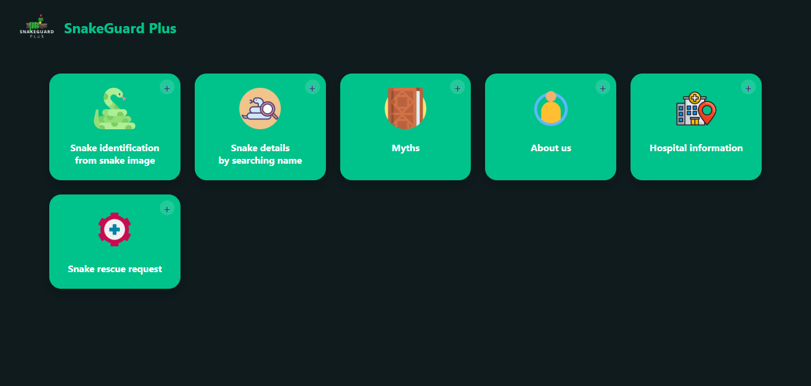

# Snake Detection and Identification System

A comprehensive system for detecting and identifying snake species from images using deep learning. This project combines a YOLO-based object detection model with a user-friendly web interface to help users identify snake species, determine if they are venomous, and learn more about them.



## Features

- **Snake Species Identification**: Upload an image of a snake to identify its species
- **Detailed Information**: Get detailed information about the identified snake, including:
  - Scientific name
  - Venomous status
  - Description and habitat
- **Visual Results**: View the processed image with bounding boxes highlighting the detected snake
- **User-Friendly Interface**: Simple and intuitive web interface for easy interaction
- **Mobile-Responsive Design**: Access the application from any device

## Demo Video

https://github.com/SikderMdSharifulIslam/snake-detection/raw/main/videos/snakeGuardPlusProjectVideo.mp4

## Installation and Setup

### Prerequisites

- Python 3.10 or higher
- Anaconda or Miniconda (recommended for environment management)
- CUDA-compatible GPU (optional, for faster inference)

### Environment Setup

1. Clone the repository:
   ```bash
   git clone https://github.com/SikderMdSharifulIslam/snake-detection.git
   cd snake-detection
   ```

2. Create and activate a conda environment:
   ```bash
   conda create -n snake python=3.10
   conda activate snake
   ```

3. Install the required packages:
   ```bash
   pip install ultralytics
   pip install torch torchvision
   ```

### Model Setup

The project uses a pre-trained YOLO model fine-tuned on snake images. The model is located at:
```
runs/detect/train2/weights/best.pt
```

If you want to train your own model, you can use the provided training script:
```bash
python custom-train.py
```

## Usage

### Starting the Server

1. Activate the conda environment:
   ```bash
   conda activate snake
   ```

2. Start the server:
   ```bash
   python snake_server.py
   ```
   The server will start on port 8000 by default. If that port is in use, it will automatically try the next available port.

3. Open your web browser and navigate to:
   ```
   http://localhost:8000
   ```

### Using the Web Interface

1. From the homepage, click on the "Snake identification from snake image" card.
2. On the identification page, either:
   - Click the upload area to select an image from your device
   - Drag and drop an image onto the upload area
3. Once an image is selected, click the "Identify Snake" button.
4. Wait for the processing to complete (this may take a few seconds).
5. View the identification results, which include:
   - The snake species name and scientific name
   - Confidence level of the identification
   - The processed image with bounding boxes
   - Description of the snake
   - Information about whether the snake is venomous

## Project Structure

```
snake-detection/
├── frontend/
│   └── snakeGuardPlus/
│       ├── index.html              # Main homepage
│       ├── identifySnake.html      # Snake identification page
│       ├── uploads/                # Directory for uploaded images
│       ├── predictions/            # Directory for prediction results
│       └── ...                     # Other frontend assets
├── runs/
│   └── detect/
│       └── train2/
│           └── weights/
│               └── best.pt         # Trained model weights
├── dataset/                        # Training dataset
├── videos/                         # Demo videos
│   └── snakeGuardPlusProjectVideo.mp4  # Project demo video
├── snake_server.py                 # Python server for handling requests
├── predict_snake.py                # Script for snake prediction
├── another.py                      # Training script
└── README.md                       # This file
```

## Technologies Used

- **Backend**:
  - Python
  - Ultralytics YOLO v8
  - PyTorch
  - HTTP Server

- **Frontend**:
  - HTML5
  - CSS3
  - JavaScript (Vanilla)

## Model Information

The snake detection model is trained on a dataset of 11 different snake species:

1. Green Vine Snake (Ahaetulla nasuta)
2. King Cobra (Ophiophagus hannah)
3. Rock Python (Python sebae)
4. Russell's Viper (Daboia russelii)
5. Saw Scaled Viper (Echis carinatus)
6. Trinket Snake (Coelognathus helena)
7. Checkered Keelback (Fowlea piscator)
8. Cobra (Naja naja)
9. Common Krait (Bungarus caeruleus)
10. Rat Snake (Ptyas mucosa)
11. Wolf Snake (Lycodon aulicus)

The model is trained using the YOLO (You Only Look Once) architecture, which is a state-of-the-art real-time object detection system.

## Future Enhancements

- Add support for snake bite identification
- Implement a mobile app version
- Expand the dataset to include more snake species
- Add location-based information about local snake species
- Integrate with emergency services for venomous snake encounters

## Credits and Acknowledgments

- Snake dataset: [Roboflow Snake Classification Dataset](https://universe.roboflow.com/snake-xj3nx/snake-classification/dataset/2)
- YOLO implementation: [Ultralytics YOLOv8](https://github.com/ultralytics/ultralytics)
- Icons and images: Various sources with appropriate licenses

## License

This project is licensed under the MIT License - see the LICENSE file for details.

## Contact

For any questions or suggestions, please contact:
- Email: sikdermdsharifulislam@gmail.com
- GitHub: [SikderMdSharifulIslam](https://github.com/SikderMdSharifulIslam)
